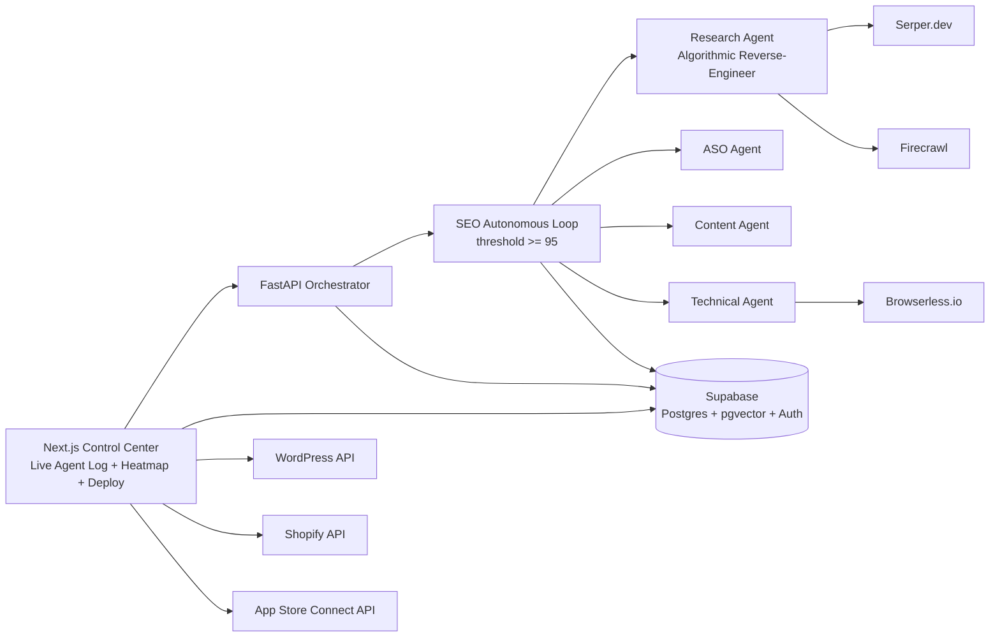

# OMNI-RANK OR-1 — System Architecture (Phase 1)

## 1) High-Level Topology



## 2) Modular Directory Structure

```text
/ (repo root)
├─ frontend/                          # Next.js 14 App Router (placeholder)
├─ backend/
│  ├─ pyproject.toml                  # Python deps + pytest config
│  ├─ app/
│  │  ├─ main.py                      # FastAPI app entrypoint
│  │  ├─ clients/
│  │  │  └─ http_clients.py           # Serper + Firecrawl adapters
│  │  ├─ core/
│  │  │  └─ config.py                 # Settings/env config
│  │  ├─ agents/
│  │  │  ├─ research_agent.py         # Reverse-engineer logic
│  │  │  └─ workflow.py               # Iterative autonomous loop
│  │  └─ schemas/
│  │     └─ research.py               # Pydantic contracts
│  └─ tests/
│     └─ test_research_agent.py
├─ shared/types/                      # Shared TS/Python contracts placeholder
├─ supabase/migrations/
│  └─ 0001_omnirank_core.sql
└─ docs/system-architecture.md
```

## 3) Research Agent Execution Logic

1. Query Serper for the top 3 ranking competitors for the target keyword.
2. Scrape each competitor URL + the client URL to normalized markdown.
3. Extract ranking signals:
   - H1/H2 coverage
   - entity maps (named-entity proxy extraction)
   - question inventory for snippet targeting
   - lexical depth and keyword density
4. Build competitor benchmark averages.
5. Compute semantic gap profile for the client page.
6. Score readiness on weighted components:
   - content depth (35)
   - entity coverage (30)
   - snippet readiness (20)
   - density health (15)
7. Emit prioritized recommendation actions.

## 4) Autonomous Feedback Loop

The `SEOAutonomousLoop` performs iterative evaluation:
- Runs research analysis.
- Checks score threshold (default: 95).
- Repeats until threshold met or max iterations reached.

Phase-1 reruns analysis each iteration; Phase-2 will apply Content/Technical/ASO remediation actions between cycles.

## 5) Data Plane + Logging

- `projects` stores campaign metadata and keyword goals.
- `competitor_intel` stores scraped competitor content and vector embeddings.
- `agent_logs` captures every autonomous action and status.
- `content_queue` stages generated assets for CMS/App Store deployment.
