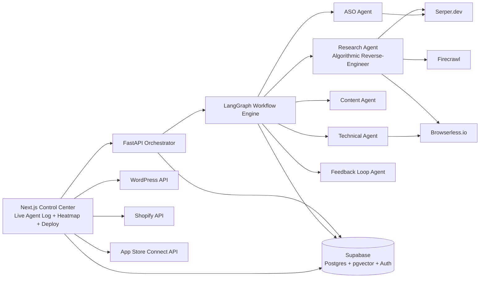

# OMNI-RANK OR-1 — System Architecture (Phase 1)

## 1) High-Level Topology



## 2) Modular Directory Structure

```text
/ (repo root)
├─ frontend/                          # Next.js 14 App Router (placeholder)
│  └─ .gitkeep
├─ backend/
│  ├─ app/
│  │  ├─ main.py                      # FastAPI app entrypoint
│  │  ├─ core/
│  │  │  └─ config.py                 # Settings/env config
│  │  ├─ agents/
│  │  │  └─ research_agent.py         # Algorithmic Reverse-Engineer logic
│  │  └─ schemas/
│  │     └─ research.py               # Pydantic request/response models
│  └─ tests/
│     └─ test_research_agent.py       # Unit tests for scoring + recommendations
├─ shared/
│  └─ types/                          # Shared TS/Python contracts placeholder
│     └─ .gitkeep
├─ supabase/
│  └─ migrations/
│     └─ 0001_omnirank_core.sql       # Required schema migration
├─ docs/
│  └─ system-architecture.md
└─ README.md
```

## 3) Agentic Workflow (LangGraph Style)

1. **Input Intake Node**
   - Accepts URL or app link, target region, language, keywords.
2. **Research Node**
   - Pulls Top 3 SERP results from Serper.
   - Fetches canonical page content via Firecrawl.
   - Builds semantic profile (entities, heading structure, term frequencies).
3. **ASO Node**
   - If app link detected, enriches with ASO ranking metadata and review themes.
4. **Content Node**
   - Generates Position Zero drafts, FAQ schema ideas, snippet-oriented sections.
5. **Technical Node**
   - Computes Core Web Vitals diagnostics and on-page technical opportunities.
6. **Scoring Node**
   - Benchmarks output against competitor profiles and computes SEO score.
7. **Iterate/Stop Node**
   - If score < 95, route back to refinement nodes.
   - If score >= 95, enqueue actions in `content_queue` and deployment tasks.

## 4) Data Plane + Logging

- Every autonomous step writes a structured event to `agent_logs`.
- Competitor extraction artifacts write to `competitor_intel` with embeddings.
- Generated assets are staged in `content_queue` before one-click deployment.

## 5) Research Agent Responsibilities (Phase 1)

The **Algorithmic Reverse-Engineer** agent currently implements:
- Top 3 competitor retrieval abstraction.
- Page-level semantic extraction:
  - title/H1/H2 inventory
  - word count and keyword density
  - entity proxy extraction (capitalized multi-word terms)
  - question pattern detection for snippet opportunities
- Gap analysis between client page and competitors:
  - missing entities
  - missing headings/questions
  - term density deltas
- Weighted SEO score generation + recommended action plan.

## 6) Next Phase Hooks

- Add vectorized entity map persistence (`pgvector`) for longitudinal competitor tracking.
- Integrate Browserless screenshot + rendered DOM extraction for JS-heavy pages.
- Attach LangGraph state persistence and retry policies.
