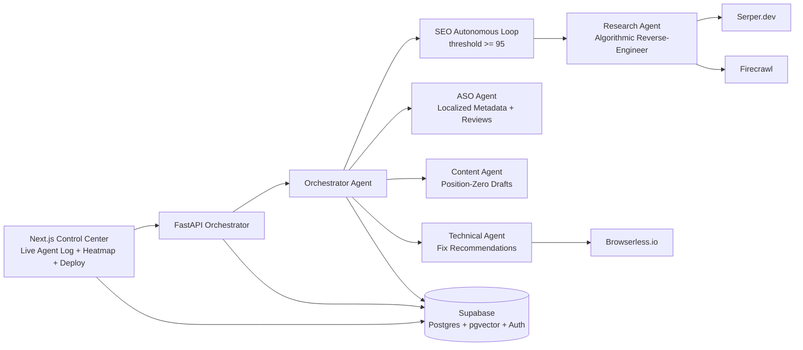

# OMNI-RANK OR-1 — System Architecture (Phase 1)

## 1) High-Level Topology

## 2) Implemented Agent Responsibilities

### Research Agent
- Pull top competitors from Serper.
- Scrape markdown via Firecrawl.
- Compute entity/question/heading gaps and SEO score.

### ASO Agent
- Detect app platform from link.
- Generate locale-aware title/subtitle/keyword/description payloads.
- Generate review-response playbooks.

### Content Agent
- Generate snippet-oriented markdown draft using missing headings/questions/entities.
- Emit ready-to-queue content payload for CMS injection.

### Technical Agent
- Infer high/medium/low technical priorities from research gaps.
- Output structured fix recommendations.

### Orchestrator Agent
- Run end-to-end multi-agent cycle.
- Produce logs, technical fixes, content queue items, and optional ASO payload.

## 3) API Endpoints

- `POST /research/run`: Research loop only.
- `POST /aso/run`: ASO only.
- `POST /orchestrator/run`: Full multi-agent cycle.

## 4) Current Gaps (Next Phase)

- Persist `logs` and generated outputs directly into Supabase tables in API handlers.
- Add Browserless-rendered CWV diagnostics for stronger technical recommendations.
- Add one-click deployment connectors (WordPress/Shopify/App Store Connect).
